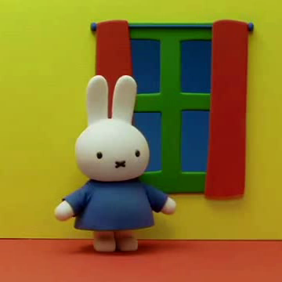
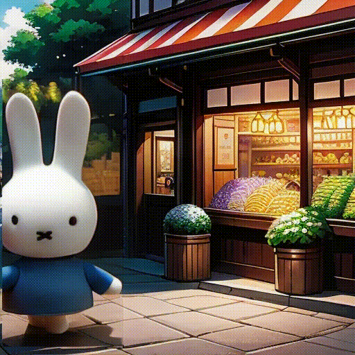
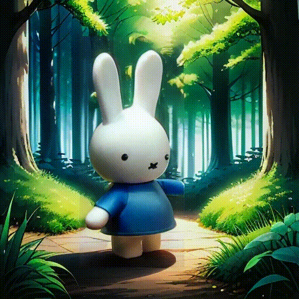
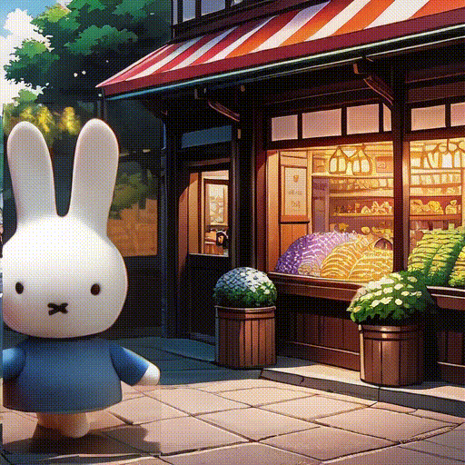
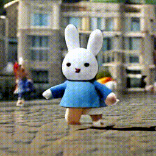
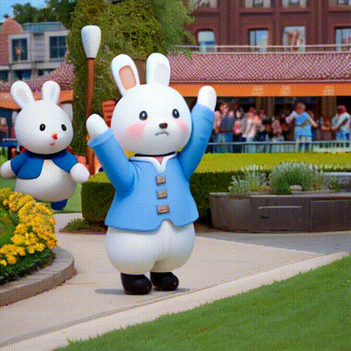
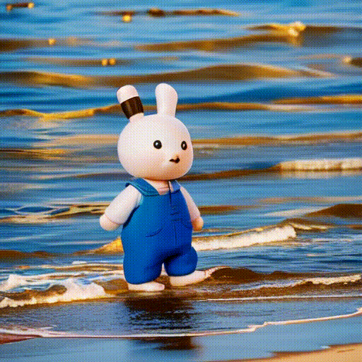

## Q1: Openset subject-Miffy
#### Reference image of subject from reference videos:

#### From left to right:
Shot1: Miffy wakes up one bright morning, ready to embark on a day filled with adventure.

Shot2: First stop is the bustling town square, where Miffy greets friends.

Shot3: Miffy explores the enchanting forest, admiring nature's beauty.

Shot4: As the sun sets, Miffy relaxes on the beach, watching the golden hues of twilight.

<table class="center">
    <tr>
    <td></figure></td>
    <td></td>
    <td></td>
    <td></td>
    </tr>
</table>

Model：TI-SparseCtrl-realistic</a>

<table class="center">
    <tr>
    <td></td>
    <td></td>
    <td></td>
    <td></td>
    </tr>
</table>

Model：TI-SparseCtrl-cartoon</a>

<table class="center">
    <tr>
    <td></td>
    <td></td>
    <td></td>
    <td></td>
    </tr>
</table>

Model：SVD</a>

<table class="center">
    <tr>
    <td></td>
    <td></td>
    <td></td>
    <td></td>
    </tr>
</table>

Model：TI-AnimateDiff</a>

<table class="center">
    <tr>
    <td></td>
    <td></td>
    <td></td>
    <td></td>
    </tr>
</table>

Model：DreamVideo</a>

<table class="center">
    <tr>
    <td></td>
    <td></td>
    <td></td>
    <td></td>
    </tr>
</table>

Model：Magic-Me</a>

<table class="center">
    <tr>
    <td></td>
    <td></td>
    <td></td>
    <td></td>
    </tr>
</table>

Model：StoryAgent</a>

